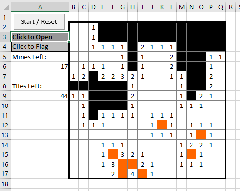
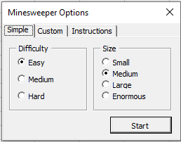
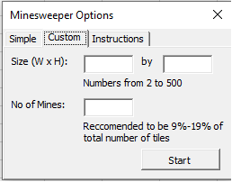
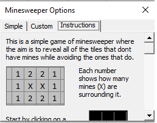
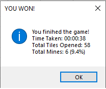
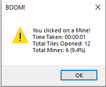

## Overview

Need a break from work? Unable to install any games? Introdcing VBA Minesweeper!  

This is an old game which I had created in the past during my free time in my previous workplace, and am putting it online for everyone to play.

## Features

- Unique maps randomly generated at the start of game
- Tiles surrounding empty spaces are opened automatically
- In game timer
- Flag tiles as possibly being mines
- Custom games with specifiable map size (from 2x2 to 500x500) and number of mines

## Requirements

Microsoft Excel with macros enabled. This was created using a 2010 version of Excel on Windows, but is likely to work on much older versions as well.

## Code

To view the code press `Alt` and `F11` to open the VBA editor.

## How to play

After opening the document, ensure that macros are enabled. Click on `Start / Reset` to bring up the menu.

### Quick Start

Click on the `Simple` tab.

1. Select a map size, which ranges from a 10x10 grid to a 50x50 one.
2. Select a difficulty level which determines the percentage of tiles that are filled with mines.
3. Click start to begin the game.

### Custom Gameplay

Click on the `Custom` tab.

1. Enter the desired width and height for the map size. Maps of up to 500x500 can be made.
2. Enter the number of mines.
3. Click start to begin the game.

### Instructions

In game instructions are available and can be accessed from the `Instructions` tab.

### Finishing a game

A game is finished either by opening all non-mine tiles or by opening a mine. This is followed by a message with the time taken, tiles opened and number of mines present.

